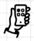
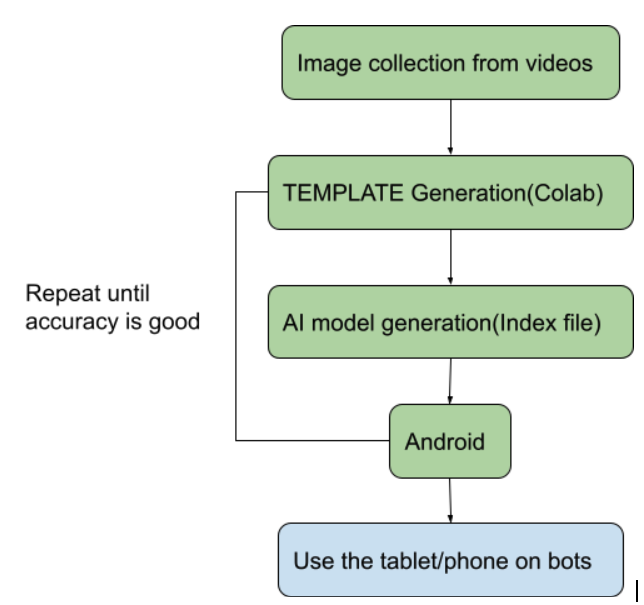
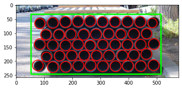
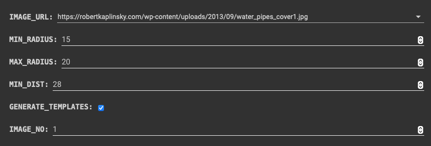
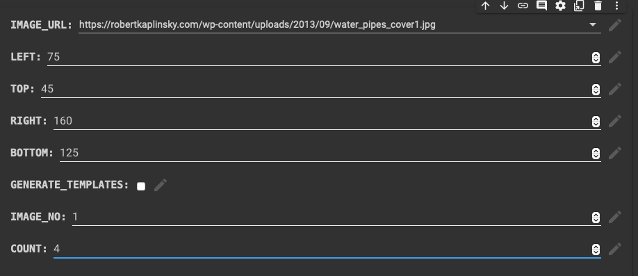
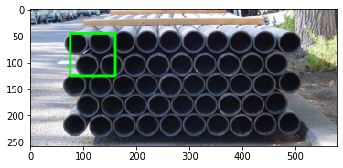

[![MIT License][license-shield]][license-url]
[![LinkedIn][linkedin-shield]][linkedin-url]


<!-- PROJECT LOGO -->
<br />
<p align="center">
  <a href="https://github.com/Princep/legendary-octo-goggles">
    
  </a>

  <h3 align="center">Count them</h3>

  <p align="center">
    AR application for counting stack of pipes
    <br />
    <a href="https://github.com/PrinceP/legendary-octo-goggles/demo.mov">View Demo</a>
    ·
    <a href="https://github.com/PrinceP/legendary-octo-goggles/issues">Report Bug</a>
    ·
    <a href="https://github.com/PrinceP/legendary-octo-goggles/issues">Request Feature</a>
  </p>
</p>


<!-- TABLE OF CONTENTS -->
<details open="open">
  <summary><h2 style="display: inline-block">Table of Contents</h2></summary>
  <ol>
    <li>
      <a href="#about-the-project">About The Project</a>
      <ul>
        <li><a href="#built-with">Built With</a></li>
        <li><a href="#design-solution">Design Solution</a></li>
        <li><a href="#workflow">Work Flow</a></li>
        <li><a href="#template-development">Template development</a></li>
        <li><a href="#ai-model-development">Model development</a></li>
        <li><a href="#deployment">Deployment</a></li>
      </ul>
    </li>
    <li>
      <a href="#getting-started">Getting Started</a>
      <ul>
        <li><a href="#prerequisites">Prerequisites</a></li>
        <li><a href="#installation">Installation</a></li>
      </ul>
    </li>
    <li><a href="#usage">Usage</a></li>
    <li><a href="#roadmap">Roadmap</a></li>
    <li><a href="#contributing">Contributing</a></li>
    <li><a href="#license">License</a></li>
    <li><a href="#contact">Contact</a></li>
    <li><a href="#acknowledgements">Acknowledgements</a></li>
  </ol>
</details>


<!-- ABOUT THE PROJECT -->
## About The Project

<!-- [[Demo]](./images/demo.gif) -->

### **Design Solution**


*Given :*

1. 1.66 - 48 inch in diameter
2. 30-60 feet long
3. Stacked in 3 - 20 layers depending on Outside Diameter size (but not higher than approx. 10Feet)
4. More than 1 thousand pipes in 1 acre
5. A tag and/or cap may be attached to the end of the tube
6. In the case of large diameter pipes, the pipe stacks are often several hundred meters long and the distance between the stacks is often so narrow that it can be difficult to take a picture from the front.
7. Since each pipe weighs up to several tons, it is difficult to calculate the number of pipes by weighing them all at once.

*Actions :*

1. Variable diameter is taken in solution for feature detection
2. Side view will be not be the best view
3. Stacks are not too high, so view will be landscape
4. Manual collection of images is not possible
5. Extra features need to be considered in solution
6. Considered at 3.
7. Weighing them is not considered.





### **Workflow**
1. Land vehicle robots to collect recordings of a particular stack.

2. Recording to done in one direction, only front of stack will be neccessary.  

2. Only one stack of pipes should be taken for each recording.

2. Take the key frames from each part of recording.(Where the pipe front is visible, at least 10 images for each recording)

2. Develop templates of each pipe: Circular region template, With tag or cap  template.

2. Identify each count of each image in the scene by putting a number.

2. Now keep adding count as the video runs in one direction.

2. *For new recording if, the old templates can be used then the accuracy of model increases over time*


### **TEMPLATE DEVELOPMENT**



1. Hough Circles are taken to identify pipe circular structure and templates are saved.

2. Manual crops of pipe with tags and caps should taken by human in loop.

3. Choose a template according to a part of image (very important)


### **AI MODEL DEVELOPMENT**

1. Use the templates to train a feature generation model

2. Use the old database created from other videos, if type of pipes are same.

2. Once trained, model is tested on validation data for more images

3. If validation accuracy is good, then pass the model to deployment module


### **DEPLOYMENT**

1. Android app will be used
2. The template used earlier will be detected multiple times in the view
2. The app will keep a count of current view, and keep adding it as the phone moves in a single direction
3. Use of the app in the land robot in future for more ease of use. 


### Built With

* mediapipe
* Colab


<!-- GETTING STARTED -->
## Getting Started

To get a local copy up and running follow these simple steps.

### Prerequisites

* mediapipe
* Colab

### Installation

1. Clone the repo
   ```sh
   git clone https://github.com/Princep/legendary-octo-goggles.git
   ```
2. Develop the template


[Colab](Count_them_up.ipynb) offers customizable solutions for images.

                                                               | 
:------------------------------------------------------------------------------------------------------------: | :----------------------------------------------------:
***OpenCV***: *Built-in fast Hough transform inference for processing. Modify radius for size* | ***Result***: *Each circle is properly detected, Easy front view can be taken*
                                                             | 
***Manual***: *Select a area which seems to be repeatable area*            | ***Area count = 4***: *Can be an area which contains tags or atleast 3 pipes*


3. Save the template image

4. Use mediapipe

```bash
cd mediapipe
# Switch to OpenCV 4
sed -i -e 's:3.4.3/opencv-3.4.3:4.0.1/opencv-4.0.1:g' WORKSPACE
sed -i -e 's:libopencv_java3:libopencv_java4:g' third_party/opencv_android.BUILD

# Build and install app
bazel build -c opt --config=android_arm64 mediapipe/examples/android/src/java/com/google/mediapipe/apps/templatematchingcpu
adb install -r bazel-bin/mediapipe/examples/android/src/java/com/google/mediapipe/apps/templatematchingcpu/templatematchingcpu.apk
```
   
5. Matching Your Own Template Images

*   Step 1: Put all template images in a single directory.

*   Step 2: To build the index file for all templates in the directory, run

    ```bash
    bazel build -c opt --define MEDIAPIPE_DISABLE_GPU=1 \
    mediapipe/examples/desktop/template_matching:template_matching_tflite
    ```

    ```bash
    bazel-bin/mediapipe/examples/desktop/template_matching/template_matching_tflite \
    --calculator_graph_config_file=mediapipe/graphs/template_matching/index_building.pbtxt \
    --input_side_packets="file_directory=<template image directory>,file_suffix=png,output_index_filename=<output index filename>"
    ```

    The output index file includes the extracted KNIFT features.

*   Step 3: Replace
    [mediapipe/models/knift_index.pb](https://github.com/google/mediapipe/tree/master/mediapipe/models/knift_index.pb)
    with the index file you generated, and update
    [mediapipe/models/knift_labelmap.txt](https://github.com/google/mediapipe/tree/master/mediapipe/models/knift_labelmap.txt)
    with your own template names.

*   Step 4: Build and run the app


<!-- USAGE EXAMPLES -->
## Usage

* Install the [apk](https://he-s3.s3.ap-southeast-1.amazonaws.com/media/sprint/mitsubishi-americas-hackathon/team/1217605/1f918b4templatematchingcpu.apk)
* Point it at the site


<!-- ROADMAP -->
## Roadmap

See the [open issues](https://github.com/Princep/legendary-octo-goggles/issues) for a list of proposed features (and known issues).


<!-- CONTRIBUTING -->
## Contributing

Contributions are what make the open source community such an amazing place to learn, inspire, and create. Any contributions you make are **greatly appreciated**.

1. Fork the Project
2. Create your Feature Branch (`git checkout -b feature/AmazingFeature`)
3. Commit your Changes (`git commit -m 'Add some AmazingFeature'`)
4. Push to the Branch (`git push origin feature/AmazingFeature`)
5. Open a Pull Request


<!-- LICENSE -->
## License

Distributed under the MIT License. See `LICENSE` for more information.


<!-- CONTACT -->
## Contact

Your Name - [@pp_spector](https://twitter.com/pp_spector) - prince.patel.14@gmail.com

Project Link: [https://github.com/Princep/legendary-octo-goggles](https://github.com/Princep/legendary-octo-goggles)


<!-- ACKNOWLEDGEMENTS -->
## Acknowledgements

* [mediapipe](https://github.com/google/mediapipe)


<!-- MARKDOWN LINKS & IMAGES -->
<!-- https://www.markdownguide.org/basic-syntax/#reference-style-links -->
[contributors-shield]: https://img.shields.io/github/contributors/Princep/repo.svg?style=for-the-badge
[contributors-url]: https://github.com/Princep/legendary-octo-goggles/graphs/contributors
[forks-shield]: https://img.shields.io/github/forks/Princep/repo.svg?style=for-the-badge
[forks-url]: https://github.com/Princep/legendary-octo-goggles/network/members
[stars-shield]: https://img.shields.io/github/stars/Princep/repo.svg?style=for-the-badge
[stars-url]: https://github.com/Princep/legendary-octo-goggles/stargazers
[issues-shield]: https://img.shields.io/github/issues/Princep/repo.svg?style=for-the-badge
[issues-url]: https://github.com/Princep/legendary-octo-goggles/issues
[license-shield]: https://img.shields.io/github/license/Princep/repo.svg?style=for-the-badge
[license-url]: https://github.com/PrinceP/legendary-octo-goggles/blob/main/LICENSE
[linkedin-shield]: https://img.shields.io/badge/-LinkedIn-black.svg?style=for-the-badge&logo=linkedin&colorB=555
[linkedin-url]: https://linkedin.com/in/princecv